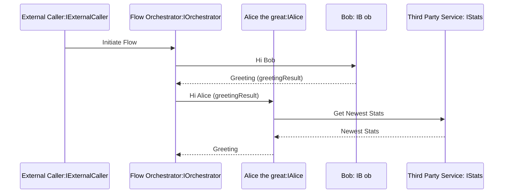



```mermaid
sequenceDiagram
    participant api as External Caller:IExternalCaller
    participant o as Flow Orchestrator:IOrchestrator
    participant a as Alice the great:IAlice
    participant b as Bob: IB ob
    participant t as Third Party Service: IStats
    api->>o: Initiate Flow
    o->>b: Hi Bob
    b-->>o: Greeting (greetingResult)
    o->>a: Hi Alice (greetingResult)
    a->>t: Get Newest Stats
    t-->>a: Newest Stats
    a-->>o: Greeting
```