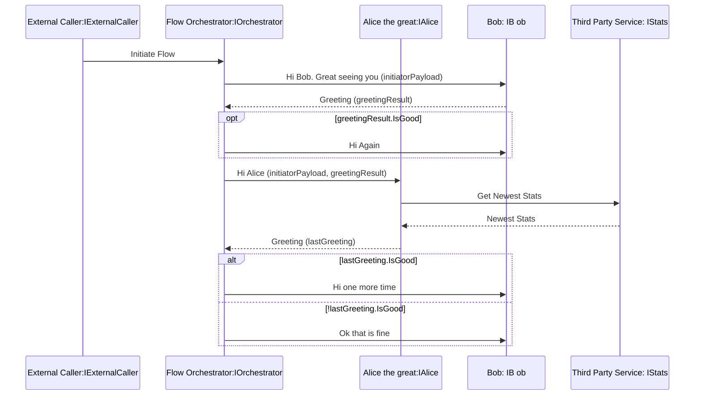



```mermaid
sequenceDiagram
    participant api as External Caller:IExternalCaller
    participant o as Flow Orchestrator:IOrchestrator
    participant a as Alice the great:IAlice
    participant b as Bob: IB ob
    participant t as Third Party Service: IStats
    api->>o: Initiate Flow
    o->>b: Hi Bob. Great seeing you (initiatorPayload)
    b-->>o: Greeting (greetingResult)
    opt greetingResult.IsGood
        o->>b: Hi Again
    end
    o->>a: Hi Alice (initiatorPayload, greetingResult)
    a->>t: Get Newest Stats
    t-->>a: Newest Stats
    a-->>o: Greeting (lastGreeting)
    alt lastGreeting.IsGood
        o->>b: Hi one more time
    else !lastGreeting.IsGood
        o->>b: Ok that is fine
    end
```